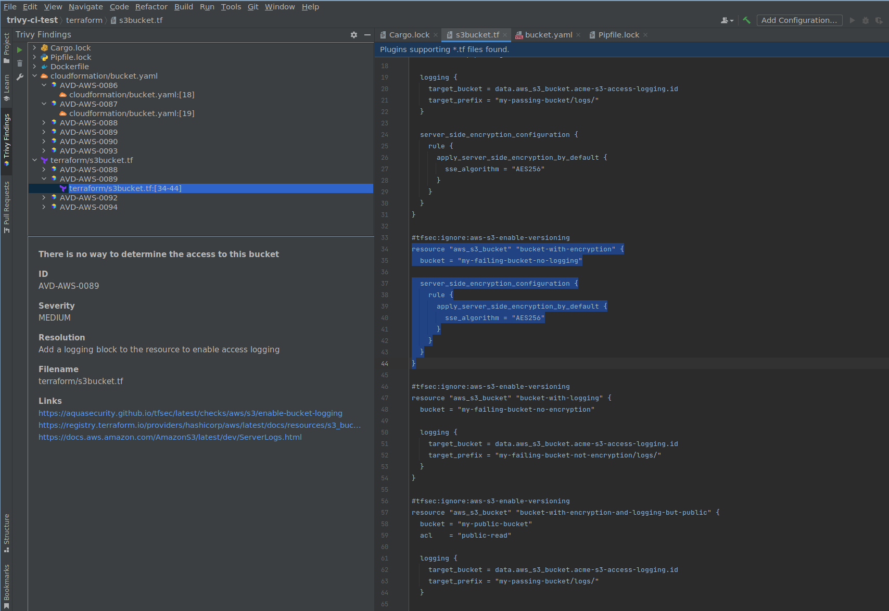

# Trivy JetBrains

Plugin for the IntelliJ suite of tools (IDEA, GoLand, WebStorm etc)

## Description

<!-- Plugin description -->
Find vulnerabilities, misconfigurations and exposed secrets in your code.

Trivy Vulnerability Scanner is an IntelliJ plugin that helps you find vulnerabilities in your software projects without leaving the comfort of the IDE.
<!-- Plugin description end -->

## Functionality

The plugin provides a visual explorer view of the vulnerabilities and IaC misconfigurations found in the project.

